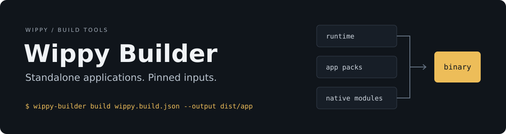

[](https://github.com/wippyai/builder/actions/workflows/check.yml)
[](LICENSE)

Build a standalone Wippy executable from a pinned runtime, versioned application
packs, and native Go components. The generated entry point calls Wippy's
`cmd/app.Main` API.

[Quick start](#quick-start) · [Commands](#commands) · [GitHub Actions](#github-actions) · [SDK](docs/SDK.md) · [Documentation](docs/README.md)

**Alpha.** CLI checks cover Linux, macOS and Windows on amd64 and arm64.
Standalone application acceptance runs on Linux amd64. The example pins runtime
[`v0.3.43a`](https://github.com/wippyai/runtime/releases/tag/v0.3.43a) by its
exact release commit; Builder compiles that source, not a downloaded runtime binary.

## Quick start

Requires Go 1.27.0, Git, and a C compiler. From this checkout:

```sh
make tools

# Build Wippy with the native components selected by the manifest.
dist/wippy-builder toolchain examples/hello/wippy.build.json --output dist/wippy

# Lint and pack the example, then assemble its executable.
make example-pack WIPPY="$PWD/dist/wippy"
make build MANIFEST=examples/hello/wippy.build.json OUTPUT=dist/hello

./dist/hello run Ada
# Hello, Ada!
```

The executable contains the runtime and application packs. First boot seeds a
local deployment; later launches preserve installed application updates.
[The hello example](examples/hello) and [Bee](https://github.com/wippyai/bee) use
the same assembly path.

## Running the assembled application

Put `--state DIR` before the operation to choose an isolated state directory.
Without it, the executable uses its named directory under the user config
directory. Its four operations are:

| Operation | Effect |
|---|---|
| `run [args...]` | Start the bundled application's command with the given arguments. A bare invocation also runs it. |
| `update <hub args...>` | Resolve and install an application pack update from Hub. The next launch uses the installed selection. |
| `recover [args...]` | Run the shipped packs with separate registry history and write a recovery receipt. It does not replace the installed selection. |
| `wippy <cli args...>` | Run the Wippy CLI against this application's deployment. |

For example:

```sh
./dist/hello --state ./dist/hello-state run Ada
./dist/hello --state ./dist/hello-state wippy version
./dist/hello --state ./dist/hello-state recover Ada
```

`run`, `update`, `recover` and `wippy` are reserved as the first word after
`--state`; other first words are passed to the application as `run` arguments.
Arguments after an operation are not parsed as host flags. Recovery does not
roll back application databases; the application owns their migration policy.

## Build inputs

[`wippy.build.json`](examples/hello/wippy.build.json) describes the complete build:

| Input | Selected by the manifest |
|---|---|
| Runtime | Exact Git commit, Go version and build tags |
| Application | Module identity, command and data paths |
| Packs | Exact module versions, local pack files, and SHA-256 checksums |
| Native components | Go module versions, import paths, and exported boot factories |

The builder copies inputs into staging, verifies their hashes, and checks out the
selected runtime commit. Go's resolved package owner and version must match each
native pin. Native modules use Wippy boot registration, typed Lua exports, and
process permissions.

To move an application to another runtime release, change the manifest's
`runtime.commit` to that tag's full commit SHA, rebuild the toolchain, repack the
application, then rebuild and test the executable. A new runtime or native Go
component needs a new executable; a Hub pack update does not replace Go code.

UI code, assets, and published configuration belong in application packs.
Native components are compiled into the executable. The [SDK guide](docs/SDK.md)
covers both paths, including filesystem notifications and argument forwarding.

## Commands

| Command | Purpose |
|---|---|
| `validate MANIFEST` | Check manifest fields and version pins |
| `toolchain MANIFEST --output PATH` | Build Wippy with the selected native components |
| `pack MANIFEST --toolchain PATH` | Pack a source root and record its checksum |
| `seal MANIFEST` | Refresh checksums after intentionally replacing input packs |
| `build MANIFEST --output PATH` | Assemble the standalone application |
| `package BINARY --output ARCHIVE` | Verify and archive the build artifacts |

Run `wippy-builder COMMAND --help` for flags and examples. Successful commands
report the manifest or output path on stderr. Status output uses terminal colors
and honors `NO_COLOR`; redirected logs remain plain text.

`pack` prepares one self-contained source root. Multi-module builds supply
independently prepared dependency packs. Private native modules set `private: true`
and use the host's Git credentials. `WIPPY_BUILD_RUNTIME_REPOSITORY` can
select a local Git mirror; the manifest commit still determines the source.

Go's normal module and compilation caches are reused across builds. Set
`GOMODCACHE` and `GOCACHE` to user-owned absolute directories to share them across
local checkouts. Runtime source is staged per build; the optional Git mirror
avoids repeatedly downloading it. GitHub workflows currently use runner-local
caches without uploading cache archives, keeping Actions cache storage unused.

## GitHub Actions

With packs prepared and their checksums recorded, add this step after checkout:

```yaml
- name: Build application
  uses: wippyai/builder@e80e35b6f9301ca01a366b4d1de3eddcf8f3e97d
  with:
    manifest: wippy.build.json
    output: dist/my-app
```

The action installs Go and builds the assembler. Set `mode: toolchain` to produce
the native development runtime. Its `builder` output provides the assembler path
for subsequent packaging steps. Private dependencies can use the `token` input.

The [example workflow](.github/workflows/check.yml) demonstrates toolchain and pack
preparation, offline execution, Hub updates, recovery, and packaging.
Bee's [release workflow](https://github.com/wippyai/bee/blob/main/.github/workflows/native.yml)
adds desktop acceptance and tag-triggered draft releases.

## Release artifacts

```sh
dist/wippy-builder package dist/hello --output dist/hello-linux-amd64.tar.gz
```

The archive contains the executable, provenance, effective `go.mod` and `go.sum`,
and available dependency notices. A separate SHA-256 file
covers the archive.

Provenance records the manifest, assembler revision, source modification status,
and artifact hashes. Packaging verifies a snapshot of every artifact before
writing the archive atomically. Archive ownership and timestamps are normalized;
binary bytes also depend on pack timestamps and the C toolchain.

## Updates

Hub updates replace the installed application pack graph. `recover` boots the
shipped packs with a separate registry history, without replacing the installed
selection. Application databases retain their normal migration checks.

Native changes require a new executable. The runtime update gate checks Lua
exports and types against the compiled modules. Semantic native-version
requirements and application acceptance beyond Linux remain pending.

## Development

See [releasing](docs/RELEASING.md) for local archives, platform checks and the
GitHub draft-release protocol.

```sh
make check
make smoke OUTPUT=dist/hello
```

`make check` runs race tests, vet, and formatting checks. Executable acceptance
covers empty-directory boot, exact argument forwarding, Hub updates, restart,
base recovery, and failed-update preservation.

Code lives in [`cmd/wippy-builder`](cmd/wippy-builder) and
[`internal/assemble`](internal/assemble). See the [implementation guide](docs/IMPLEMENTATION.md)
for ownership, validation, and remaining release work.

## License

Builder is [MIT licensed](LICENSE). Applications, Wippy, and native dependencies
retain their own licenses. CLI archives include [dependency notices](THIRD_PARTY_NOTICES.txt).
The generated application notice inventory lists missing root
license files for review before public distribution.

[Contributing](CONTRIBUTING.md) · [Code of conduct](https://github.com/wippyai/.github/blob/main/.github/CODE_OF_CONDUCT.md) · [Security](SECURITY.md)
